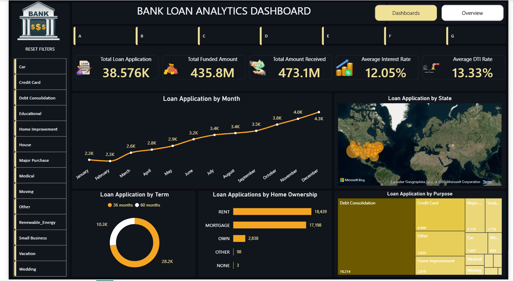
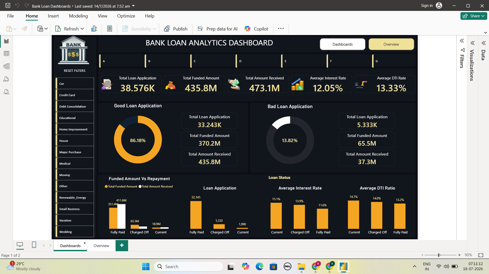

# 📊 Bank Loan Analytics Dashboard
## Project Overview
This project presents an interactive Bank Loan Analytics Dashboard developed in Power BI to analyze loan performance, customer behavior, funding, repayment trends, and loan quality.
The dashboard enables business users to monitor key banking metrics and make data-driven decisions through interactive visualizations.
---
## Dashboard Preview

## Summary Preview

---
## Tools Used
- Power BI
- Power Query
- DAX
- Data Modeling
- Excel
---
## Key KPIs
- Total Loan Applications
- Total Funded Amount
- Total Amount Received
- Average Interest Rate
- Average DTI Ratio
---
## Dashboard Features
- Interactive Filters
- Loan Purpose Analysis
- State-wise Loan Distribution
- Monthly Loan Trend
- Loan Term Analysis
- Home Ownership Analysis
- Good vs Bad Loan Analysis
- Loan Status Comparison
---
## Skills Demonstrated
- Data Cleaning
- Data Modeling
- DAX Calculations
- KPI Design
- Dashboard Design
- Business Intelligence
- Data Visualization
- Interactive Reporting
---
## Business Insights
- Track overall loan performance
- Monitor repayment trends
- Compare good and bad loans
- Analyze customer loan purposes
- Evaluate funding efficiency
- Identify high-performing states
---
## Repository Structure
```
Data/
PowerBI/
Images/
Documentation/
DAX/
README.md
```
---
## Author
**Kaleem Asharaf**
LinkedIn:
https://linkedin.com/in/yourprofile
